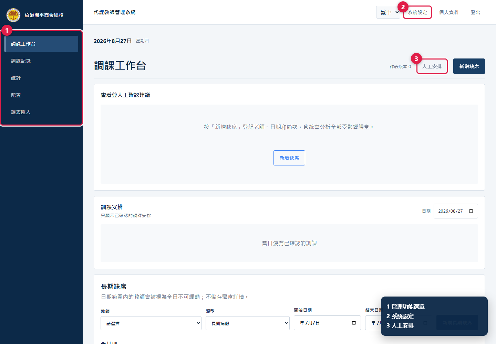
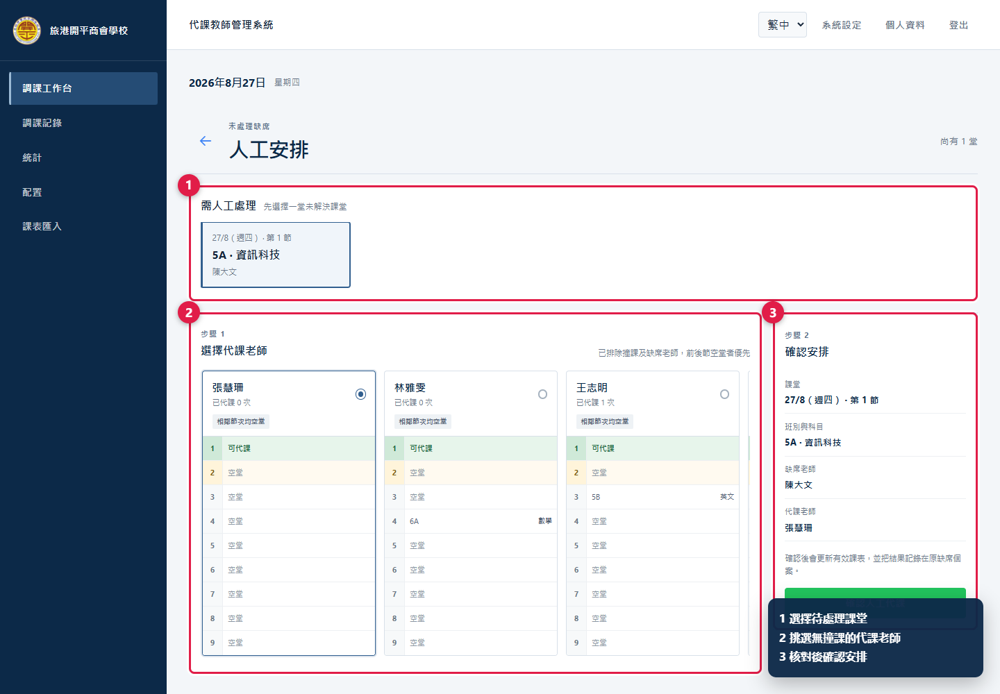
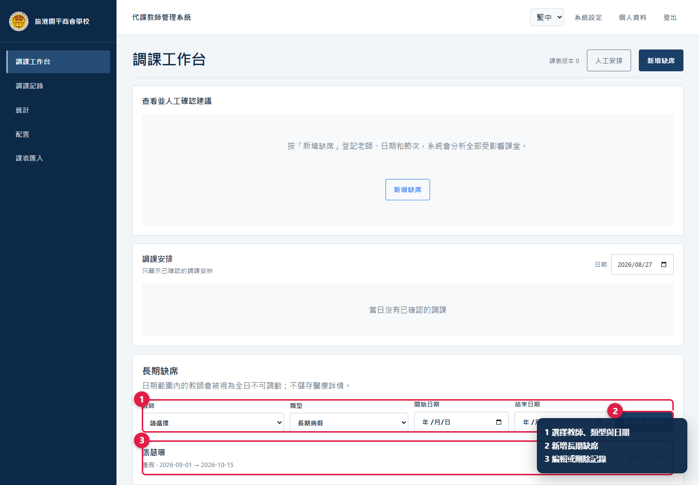
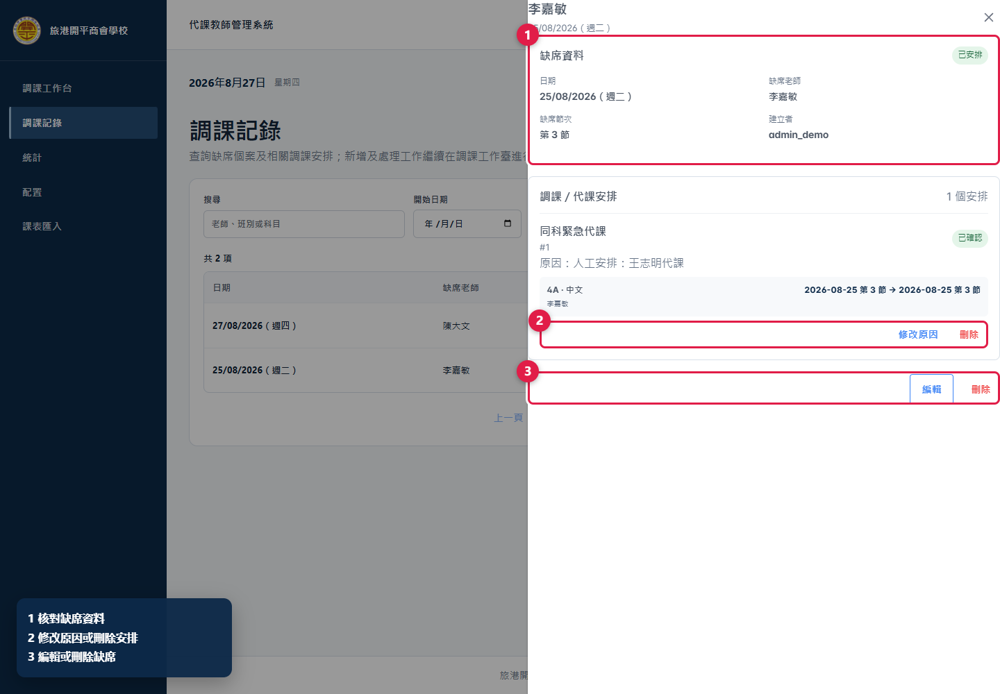
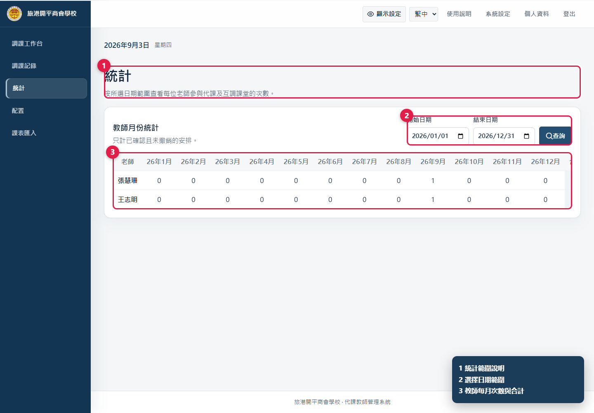
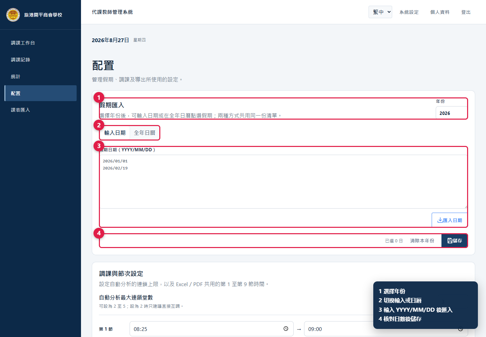
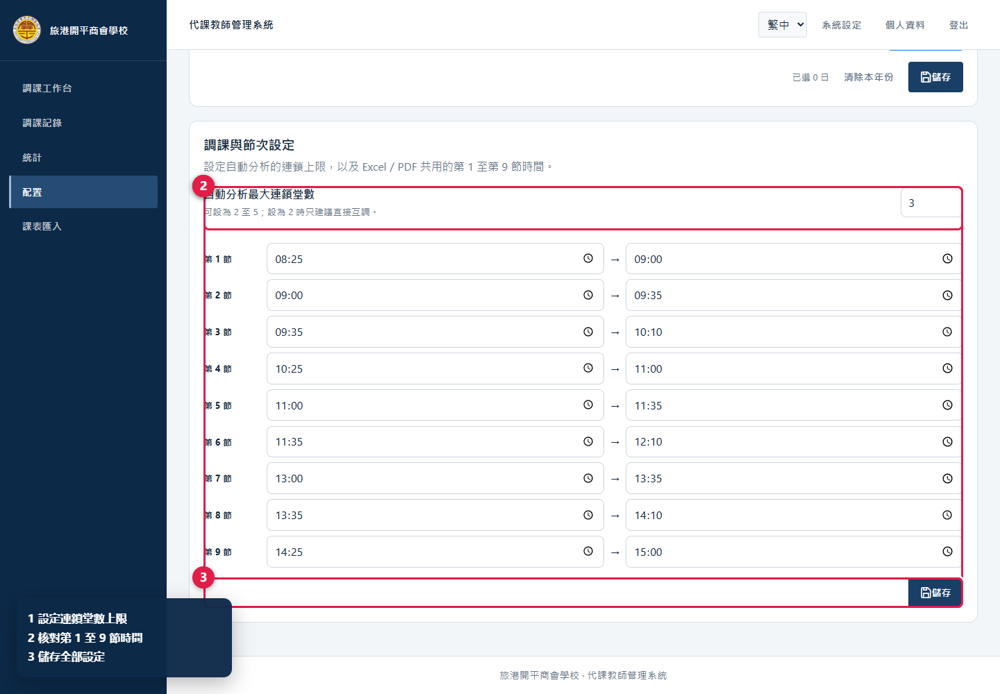
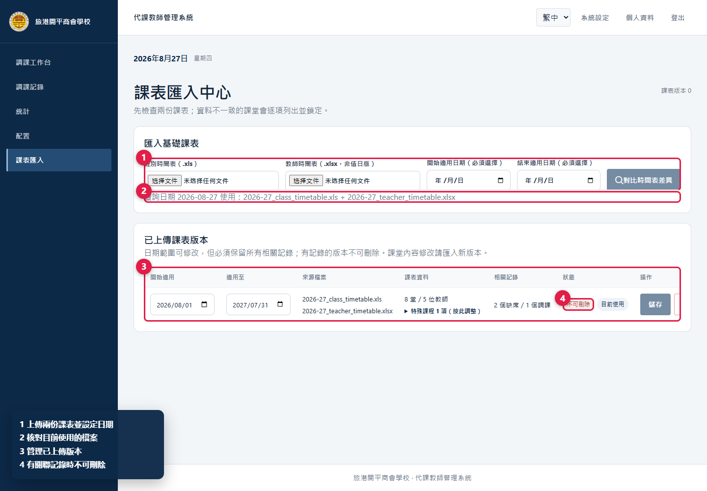
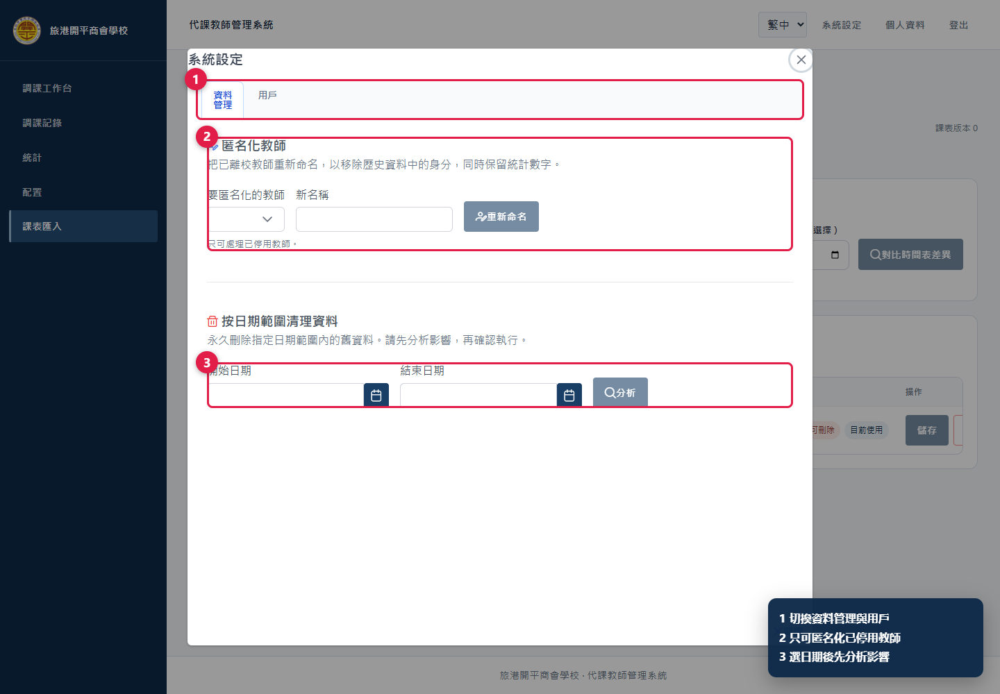
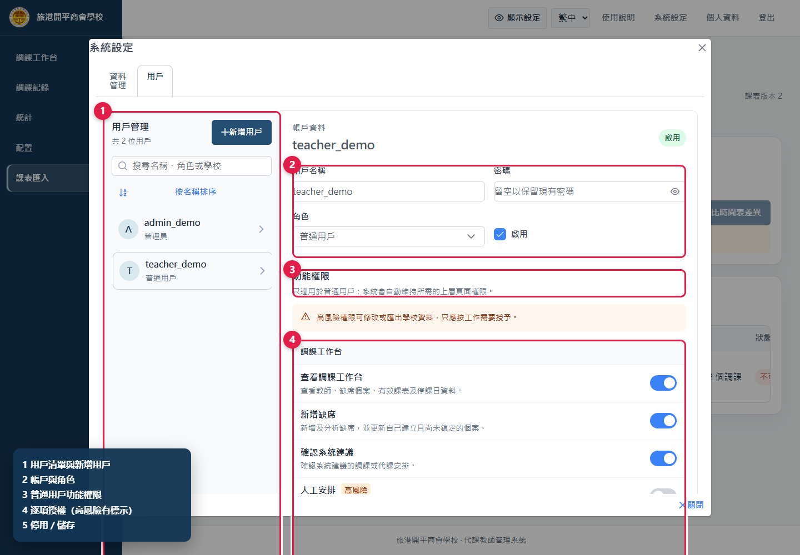

# 代課教師管理系統——管理員使用說明書

適用對象：學校管理員及超級管理員

更新日期：2026 年 9 月 1 日

> 圖中的紅框及圓形數字是操作位置，角落圖例說明各標註用途。所有畫面均使用示例資料。

## 一、管理員角色

管理員具備普通用戶全部功能，另可人工安排、管理長期缺席和記錄、查看統計、匯出每日表、配置假期及節次、管理課表版本、用戶和資料。

本手冊以學校管理員為主。學校管理員只管理所屬學校，可建立普通用戶或管理員；跨校管理、建立超級管理員及永久刪除用戶只供超級管理員處理。

修改課表、撤銷安排、刪除、匿名化和永久清理都會影響全校或歷史資料。執行前必須核對對象、日期、節次、依賴和影響數量。

## 二、登入及管理介面

管理員和普通用戶使用同一登入頁。選擇語言、輸入用戶名稱和密碼後按「登入」。

*圖 1　管理員與普通用戶共用登入頁。*

*圖 2　完整管理選單、每日匯出、人工安排、長期缺席及系統設定入口。*

- 左側：調課工作台、調課記錄、統計、配置、課表匯入。
- 工作台上方：「匯出代課表」。
- 右上方：「使用說明」、「系統設定」、「個人資料」及「登出」。
- 「使用說明」會在新分頁直接開啟管理員版手冊。
- 「課表版本」是有效課表修訂序號；多人操作後如序號改變，應重新載入及核對。

普通用戶的新增缺席、核對建議、確認安排、搜尋記錄及更改密碼，請參閱[用戶使用說明書](TEACHER_USER_GUIDE_ZH_HK.md)。

## 三、建議的每日流程

1. 檢查當日缺席，按需要追加同一老師的新缺席節次。
2. 先處理系統建議，逐項核對涉及老師課表。
3. 用「人工安排」處理未解決或不採用系統候選的課堂。
4. 在「調課安排」核對當日有效課表和局部修復結果。
5. 在「調課記錄」檢查待處理、需覆核和執行狀態。
6. 所有安排完成後，才下載和派發每日 Excel 或 PDF。

## 四、人工安排

人工安排同時列出未解決課堂，以及使用者主動放棄系統候選而轉入的課堂。

*圖 3　先選課堂，再比較候選老師的全日課表，最後確認。*

1. 在工作台按「人工安排」，或由建議卡片轉入。
2. 在「可人工安排的課堂」選擇一項，核對日期、節次、班別、科目和缺席老師。
3. 比較候選老師：已代課次數、相同科目、相鄰節次及當日全部節次的課表。
4. 選擇老師，在右側再次核對摘要。
5. 按「確認人工代課」。有效課表和原缺席個案會同時更新。

系統已排除該節撞課及缺席老師，但候選排序只供參考。如原課堂仍有共同教師，畫面可能提供由共同教師繼續上課的選項，確認前應按校內安排判斷。

若另一位使用者已修改課表，舊修訂的確認會被拒絕；重新開啟人工安排再選一次。

## 五、長期缺席

*圖 4　新增、編輯或刪除長期缺席。*

1. 在工作台下方選擇教師和類型：長期病假、產假或其他長期缺席。
2. 填寫開始和結束日期；兩日都包含在範圍內。
3. 按「新增長期缺席」。
4. 需要改期時使用現有記錄的「編輯」；不要建立重疊記錄。

範圍內的教師會被視為全日不可調動，也不會成為代課候選。系統只需要類型和日期，不應輸入醫療詳情。編輯或刪除後，正在處理的建議應重新分析。

## 六、記錄管理、執行狀態及依賴

*圖 5　詳情顯示缺席、安排、執行狀態，以及可用的撤銷、修改和刪除操作。*

### 6.1 操作含義

- 「重新挑選方案」：供同時具「管理調課記錄」和「新增缺席」權限的人員使用；還原尚未開始且沒有下游依賴的安排後，直接回到工作台為同一缺席重新分析及選擇方案。
- 「撤銷安排」：其他具管理權限的人員會看到這個名稱；操作同樣還原有效課表變動並保留缺席個案，但不會自動返回工作台。
- 「修改缺席」：修改老師、日期、原因或節次；如會影響既有安排，系統會先阻止或要求處理相關安排。
- 「刪除」：刪除整個缺席個案及相關資料，只應用於確定建立錯誤的個案。

新增流程遇到同一老師同一天的既有缺席時，只追加新節次，不會改原因或移除舊節次；這類更正應在記錄詳情處理。

### 6.2 執行狀態

| 狀態 | 管理意義 |
|---|---|
| 尚未開始 | 所有相關課堂仍在未來，可在無下游依賴時撤銷 |
| 部分完成 | 部分課堂已開始／完成，不可當作全新安排任意重寫 |
| 已完成 | 相關上課時間已過，歷史記錄應保留 |

### 6.3 撤銷限制及順序

已確認安排只有在「尚未開始」而且沒有後續調動依賴時才可撤銷。若 A 的結果被 B 使用，必須先撤銷最新、尚未開始的 B，再返回撤銷 A。已開始或已完成的安排不能直接撤銷，避免把已發生的課堂從歷史中抹去。

有效課表是目前真實狀態。如已移動課堂的老師後來缺席，系統只修復受影響的局部鏈路，保留無關安排；處理後要再次核對課堂閉環和當日班級課表。

## 七、統計及每日匯出

### 7.1 統計

*圖 6　設定日期範圍，查看每位老師的每月次數和合計。*

1. 進入「統計」。
2. 設定開始和結束日期，按「查詢」。
3. 表格只計已確認且未撤銷的代課／互調安排。

統計頁只顯示統計；匯出入口已移到工作台上方。

### 7.2 每日 Excel／PDF

1. 返回「調課工作台」，按「匯出代課表」。
2. 選擇日期，下載 Excel 或 PDF。
3. Excel 是一個活頁簿，每名缺席老師一個工作表。
4. PDF 是一個檔案，A4 直向每頁上下兩張表；奇數張時最後一頁只使用上半部，不會下載 ZIP。

附註會使用自然語句描述代課、互調，以及原任老師改到的新時間。下載前先確認當日沒有未解決課堂，並核對節次時間。

系統會按所選日期生效的課表自動決定版面：普通課表使用第 1 至第 9 節；試後課表只顯示第 1 至第 5 節，時間依次為 08:25–09:15、09:15–10:05、10:25–11:15、11:15–12:05、12:25–13:00。Excel、PDF、缺席節次及課表核對畫面會使用同一套節次。

## 八、配置假期、連鎖上限及節次時間

### 8.1 假期

*圖 7　可貼上日期或在全年日曆點選，最後都要儲存。*

1. 選擇年份。
2. 使用「輸入日期」，每行輸入一個 `YYYY/MM/DD`；或切換「全年日曆」直接點選。
3. 核對已選日數，按「儲存」。

「匯入日期」只把文字加入待儲存清單，仍要按「儲存」。使用「清除本年份」後再儲存會移除該年全部假期，操作前須再次核對。

### 8.2 連鎖分析及節次

*圖 8　設定自動分析上限及第 1 至第 9 節時間。*

- 自動分析最大連鎖堂數可設為 2 至 5；設為 2 時只建議直接互調。
- 第 1 至第 9 節開始／結束時間用於普通課表日期的 Excel 和 PDF。
- 試後課表日期會自動改用固定的 5 節試後時間，不受此處第 6 至第 9 節設定影響。
- 修改後按「儲存」。既有已確認安排不會被重寫；未處理個案應回工作台重新分析。

## 九、課表匯入及版本管理

*圖 9　上傳兩份課表、設定適用日期，並管理已上傳版本。*

### 9.1 上傳及覆核

1. 選擇正常課表或試後課表。
2. 上傳班別時間表 `.xls` 和教師時間表 `.xlsx`（非值日版）。
3. 必須設定開始和結束適用日期。
4. 按「對比時間表差異」，查看課堂數、教師數、警告及被封鎖課堂。
5. 修正「錯誤」；對「需覆核」選擇班別表或教師表的資料並保存決定。
6. 標記不應被一般自動調動的特殊課程。
7. 沒有錯誤且所有覆核已完成後才啟用。

試後課表只在選定日期內覆蓋正常課表。啟用後要抽查數個班別和老師，並確認工作台、缺席節次和匯出表都只顯示第 1 至第 5 節。

### 9.2 版本日期及未儲存提示

- 版本表按一組顯示開始／結束日期、來源檔案、課堂／教師數、相關記錄和狀態。
- 修改日期後，該列會標示「尚未儲存」，並出現「儲存修改／取消修改」。
- 有未儲存變更時離開課表匯入頁或關閉視窗，瀏覽器會提示確認。
- 新日期範圍必須保留所有關聯記錄；有記錄的版本不可刪除。
- 課堂內容如需改動，應匯入新版本，不要改寫有歷史資料的舊版本。

## 十、系統設定：資料管理

*圖 10　資料分頁包含匿名化停用教師及按日期範圍清理。*

### 10.1 匿名化停用教師

1. 先確認教師已離校且已停用；啟用中的教師不會出現在清單。
2. 選擇教師，輸入不含身分資料的新名稱。
3. 按「重新命名」並確認。

匿名化保留統計數字，但移除歷史畫面的原姓名。系統不會保存姓名對照；如校內程序要求留存，應在系統外安全處理。

### 10.2 按日期永久清理

1. 先備份並取得所需批准。
2. 選擇日期範圍，按「分析」。
3. 閱讀資料庫記錄、文件及課表版本等影響清單。
4. 只有範圍和數量完全正確時，才執行永久清理。

永久清理不能在介面內復原，不可當作一般整理工具。

## 十一、系統設定：用戶及權限

*圖 11　左側管理用戶，右側編輯帳戶、角色和逐項權限。*

### 11.1 新增或編輯帳戶

1. 切換至「用戶」，按「新增用戶」或從左側選擇現有帳戶。
2. 填寫用戶名稱；新帳戶必須設定初始密碼，現有帳戶密碼留空表示不更改。
3. 選擇普通用戶或管理員，設定啟用狀態。
4. 普通用戶按工作需要逐項分配權限，然後按「儲存」。
5. 用安全方式交付初始密碼，要求使用者首次登入後更改。

離任人員應停用帳戶，保留歷史操作記錄；不要改名後轉交他人或建立多人共用帳戶。

### 11.2 十項普通用戶權限

1. 查看調課工作台
2. 新增缺席
3. 確認系統建議
4. 人工安排（高風險）
5. 查看調課記錄
6. 管理調課記錄（高風險）
7. 查看統計
8. 下載每日表格（高風險）
9. 上傳及預覽課表
10. 啟用及管理課表（高風險）

開啟新增缺席、確認建議、人工安排或每日下載時，系統會同時開啟「查看調課工作台」；開啟記錄管理時會同時開啟「查看調課記錄」。關閉上層權限會一併關閉依賴功能。

管理員和超級管理員永遠擁有全部權限，個別開關不適用。後端權限會在下一次請求即時生效；用戶重新載入後，導覽和按鈕亦會同步。

## 十二、常見問題

### 人工安排沒有待處理課堂

先確認缺席已建立、所選節次有課，並已分析。已有候選但不採用時，要由該卡片轉入人工安排。

### 安排不能撤銷

查看執行狀態及依賴。已開始／完成不能撤銷；有下游依賴時，先撤銷最新且尚未開始的依賴安排。

### 課表版本不能刪除

版本正在使用或已有缺席／調課記錄。匯入新版本並保留舊版本，以維持歷史一致性。

### 「對比時間表差異」不能按

確認兩份檔案和開始／結束日期均已提供，且檔案格式為班別 `.xls`、教師 `.xlsx`。

### 用戶不能登入或看不到功能

在「系統設定」→「用戶」檢查啟用狀態、角色及逐項權限。權限改動後請用戶重新載入。

### 匯出內容或時間不正確

核對匯出日期、已確認安排和「配置」中的節次時間，再重新下載。

## 十三、管理檢查表

### 每日

- [ ] 缺席日期、原因和節次正確，沒有重複個案；
- [ ] 每個系統建議都已核對老師課表；
- [ ] 未解決課堂已人工安排或交代跟進；
- [ ] 執行中／已完成安排沒有被錯誤撤銷；
- [ ] 有依賴的安排按最新至最舊順序處理；
- [ ] 匯出前當日有效課表已核對。

### 每次匯入課表

- [ ] 兩份來源檔案屬同一版本和學年；
- [ ] 適用日期沒有空檔或錯誤重疊；
- [ ] 所有錯誤已修正、所有覆核已保存；
- [ ] 特殊課程標記正確；
- [ ] 沒有遺留「尚未儲存」的版本修改；
- [ ] 啟用後已抽查班別及教師課表。

### 刪除、匿名化或永久清理前

- [ ] 已確認對象、日期範圍和影響數量；
- [ ] 已閱讀警告及依賴；
- [ ] 已取得批准並完成可用備份；
- [ ] 已確定操作後的重新分析或通知安排。

## 十四、技術支援資料

提供發生時間、登入角色、缺席日期／節次、老師、班別、科目、課表檔名、適用日期和完整錯誤訊息。可附不含密碼及敏感資料的截圖；不要傳送密碼。
