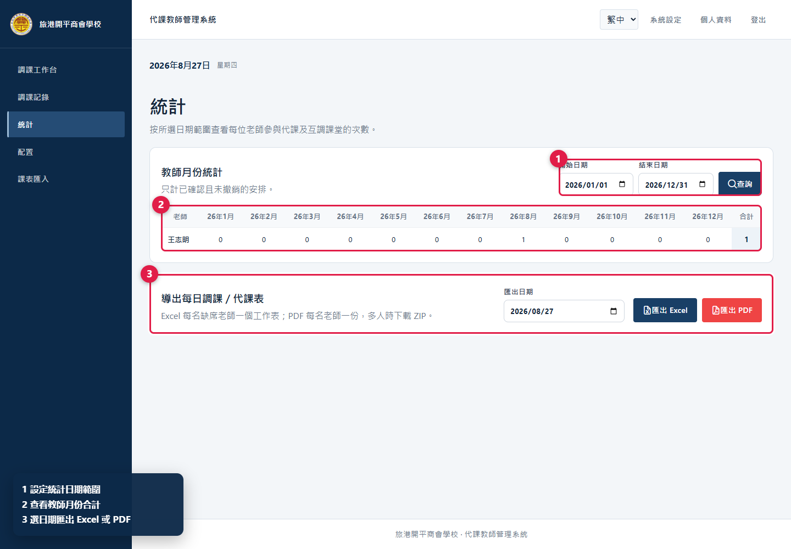
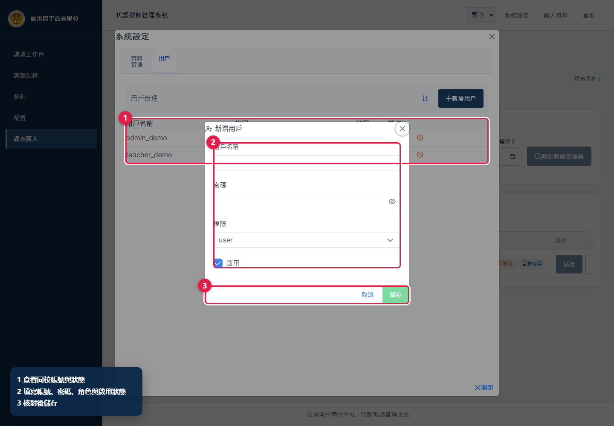

# 代課教師管理系統——管理員使用說明書

更新日期：2026 年 8 月 27 日

> 圖中紅色框及圓形數字標示操作位置；角落圖例說明每個標註的用途。截圖使用本機示例資料，不包含真實老師、課表或帳號資料。

## 一、管理員的職責及權限

管理員除可完成一般教師的操作外，亦可：

- 人工指定代課老師，處理系統未能自動解決的課堂；
- 管理長期缺席；
- 修改或刪除缺席及調課記錄；
- 查看統計及匯出每日代課表；
- 設定假期、節次時間及自動分析的連鎖堂數上限；
- 匯入、檢查及管理課表版本；
- 管理同一學校的用戶帳號；
- 匿名化已停用教師，以及按日期範圍清理舊資料。

管理員操作可改變全校有效課表及歷史記錄。按「確認」、「刪除」、「匿名化」或「永久清理」前，必須再次核對對象、日期、節次及影響範圍。

### 管理員與超級管理員的分別

本說明書以一般學校管理員（`admin`）為準。一般管理員只管理所屬學校，可建立 `user` 或 `admin` 帳號、編輯帳號或停用帳號。跨校管理、建立 `super_admin` 及永久刪除用戶只供超級管理員處理。

## 二、登入及管理介面

### 2.1 登入

1. 使用瀏覽器開啟學校提供的系統網址。
2. 選擇所需介面語言。
3. 輸入管理員用戶名稱及密碼。
4. 按「登入」。

*圖 1　登入系統；管理員與教師使用同一登入頁。*

如連續多次輸入錯誤，系統會暫停登入並顯示等候時間。倒數完成後再試，不要持續重複按「登入」。

### 2.2 管理員選單

*圖 2　管理員登入後可看到完整管理選單、系統設定及人工安排入口。*

圖 2 的主要位置：

1. 左側管理選單：調課工作台、調課記錄、統計、配置及課表匯入。
2. 「系統設定」：資料管理及用戶管理。
3. 「人工安排」：處理系統沒有自動方案的課堂。

右上角「課表版本」數字是目前課表修訂序號。其他使用者確認、撤銷或更新安排後，序號會改變；如系統提示課表已被修改，應重新載入並再次核對。

## 三、建議的日常處理次序

1. 在「調課工作台」登記當日缺席並分析。
2. 先處理系統提供的自動調課／代課建議。
3. 進入「人工安排」，處理仍顯示未解決的課堂。
4. 在「調課安排」核對當日有效課表。
5. 在「調課記錄」搜尋個案並檢查狀態。
6. 如需派發名單，在「統計」按日期匯出 Excel 或 PDF。

新增缺席、核對建議、確認安排及查看記錄的基本流程與教師相同，請參閱[教師使用說明書](TEACHER_USER_GUIDE_ZH_HK.md)第四至八節。以下集中說明管理員專用功能。

## 四、人工安排未解決課堂

當系統沒有合適的直接互調、連鎖互調或同科代課方案時，課堂會留在「未處理」狀態。

*圖 3　人工安排分為待處理課堂、代課候選及最終確認三部分。*

### 操作步驟

1. 在「調課工作台」按「人工安排」。
2. 在「需人工處理」選擇一堂課（圖 3-1），核對日期、節次、班別、科目及缺席老師。
3. 在候選老師清單查看每人的當日課表（圖 3-2）。系統已排除該節撞課及缺席的老師，並顯示：
   - 該老師已代課次數；
   - 是否教授相同科目；
   - 目標節次是否可代課；
   - 前後節及全日課堂分布。
4. 選擇合適老師。候選排序只供參考，仍須按校內安排及實際情況判斷。
5. 在右側「確認安排」再次核對資料（圖 3-3）。
6. 按「確認人工代課」。確認後，有效課表及原缺席個案會一併更新。

如原課堂有仍在場的共同任教老師，畫面可能提供「由原任老師單獨上課」選項。只有確定該老師能獨立承擔課堂時才確認。

### 找不到課堂或候選老師

- 「尚有 0 堂」表示目前沒有未解決課堂；先返回工作台確認缺席是否已建立及分析。
- 候選清單為空表示所有可用老師均缺席或撞課；不要重複建立缺席，可先調整其他安排或聯絡排課負責人。
- 如另一位使用者同時修改課表，系統會拒絕舊版本的確認；重新開啟人工安排再選一次。

## 五、管理長期缺席

長期缺席日期範圍內，該教師會被視為全日不可調動，也不會成為代課候選。系統只保存類型及日期，不應輸入醫療詳情。

*圖 4　新增、編輯及刪除長期缺席。*

### 新增

1. 在「調課工作台」下方找到「長期缺席」。
2. 選擇教師、類型、開始日期及結束日期（圖 4-1）。
3. 類型可選「長期病假」、「產假」或「其他長期缺席」。
4. 核對日期後按「新增長期缺席」（圖 4-2）。開始及結束日期均包含在缺席範圍內。

同一教師不可建立日期重疊的長期缺席。如需延長或縮短，使用現有記錄的「編輯」，不要再新增一筆。

### 編輯或刪除

在記錄右側按「編輯」或「刪除」（圖 4-3）。更改後，系統會更新課表修訂序號；正在處理的建議應重新分析。

## 六、管理調課記錄

進入「調課記錄」，可按搜尋字、日期、狀態及類型篩選，再按「查看」開啟右側詳情。

*圖 5　管理員可在記錄詳情修改原因、撤銷安排，以及編輯或刪除缺席。*

### 6.1 修改安排原因

在「調課／代課安排」按「修改原因」（圖 5-2），輸入新的說明。這只更改記錄文字，不會改變老師、日期或節次。

### 6.2 刪除一項安排

在安排右側按「刪除」（圖 5-2）並確認。系統會撤銷該安排、還原有效課表，並把仍需處理的缺席重新設為待處理。其後應返回工作台重新分析或人工安排。

### 6.3 編輯缺席

1. 按頁面底部「編輯」（圖 5-3）。
2. 修改教師、日期或節次。
3. 如缺席已有安排，系統會警告編輯將移除相關安排。
4. 確認後儲存，再回到工作台重新分析。

### 6.4 刪除缺席

按「刪除」（圖 5-3）會永久清除該缺席及其相關安排。除非確定整個個案均為錯誤資料，否則應優先只撤銷錯誤安排，再重新處理缺席。

> **重要：**刪除安排及刪除缺席的影響不同。前者保留缺席並讓它重新待處理；後者清除整個缺席個案及相關安排。

## 七、查看統計及匯出每日表

*圖 6　設定統計範圍、查看每月合計及匯出指定日期的代課表。*

### 7.1 教師月份統計

1. 在左側選單進入「統計」。
2. 設定開始及結束日期，按「查詢」（圖 6-1）。
3. 表格按月份顯示每位老師參與已確認代課或互調的次數，最右方是合計（圖 6-2）。

統計只計算已確認且未撤銷的安排。修改原因不影響次數；撤銷安排後，重新查詢即可看到更新結果。

### 7.2 匯出每日表

1. 在「導出每日調課／代課表」選擇日期（圖 6-3）。
2. 按「匯出 Excel」或「匯出 PDF」。
3. Excel 會按缺席老師分工作表；PDF 每名老師一份，多人時系統會下載 ZIP。

匯出前先在工作台確認當日所有課堂已處理，並核對日期及節次時間設定。

## 八、配置假期及節次

### 8.1 假期設定

假期內不會建立一般上課日的缺席及調課安排。

*圖 7　可輸入日期或在全年日曆點選；兩種方式共用同一份假期清單。*

#### 文字輸入方式

1. 選擇年份（圖 7-1）。
2. 選擇「輸入日期」（圖 7-2）。
3. 每行輸入一個日期，格式必須為 `YYYY/MM/DD`（圖 7-3）。
4. 按「匯入日期」。這一步只把日期加入待儲存清單。
5. 核對「已選」日數，再按「儲存」（圖 7-4）。

#### 全年日曆方式

切換至「全年日曆」，點選日期即可加入或移除。完成後仍要按「儲存」。按「清除本年份」後，如再按「儲存」，會移除該年份全部假期，操作前務必核對。

### 8.2 連鎖上限及節次時間

*圖 8　設定自動分析連鎖堂數，以及第 1 至第 9 節時間。*

1. 「自動分析最大連鎖堂數」可設為 2 至 5（圖 8-1）。
2. 設為 2 時只建議直接互調；數值越高，可分析較長連鎖，但候選方案也會更複雜。
3. 核對第 1 至第 9 節的開始及結束時間（圖 8-2）。時間會用於 Excel／PDF 匯出。
4. 按「儲存」（圖 8-3）。

更改連鎖上限不會自動重寫已確認安排；如要套用於未處理課堂，返回工作台重新分析。

## 九、匯入及管理課表版本

課表匯入會影響全校分析結果。建議由一名指定管理員執行，並先保存兩份來源檔案及資料備份。

*圖 9　上傳兩份課表、核對目前檔案，以及管理已上傳版本。*

### 9.1 匯入前準備

- 班別時間表：`.xls`；
- 教師時間表：`.xlsx`，使用非值日版；
- 確定開始及結束適用日期；
- 確認兩份檔案屬於同一版本及同一學年；
- 避免多人同時匯入或確認調課。

### 9.2 檢查及啟用新版本

1. 在「課表匯入」上傳班別時間表及教師時間表（圖 9-1）。
2. 選擇開始及結束適用日期。
3. 按「對比時間表差異」。
4. 查看班級數、教師數、課堂數、被封鎖課堂及問題清單。
5. 按實際課表標記特殊課程。特殊課程不應被一般自動調動。
6. 處理問題清單：
   - 「錯誤」：回到來源 Excel 修正後重新上傳；
   - 「需覆核」：選擇採用班別時間表或教師時間表的資料，再確認決定；
   - 多項同類覆核可先勾選，再使用批量決定及「確認所選」。
7. 所有錯誤已修正、覆核決定已保存後，按「啟用」。
8. 啟用後核對畫面顯示的目前檔案（圖 9-2），再到工作台抽查數個班別及老師。

在錯誤或未確認覆核仍存在時，「啟用」會保持停用，不能強行略過。

### 9.3 管理已上傳版本

版本表會顯示適用日期、來源檔案、課堂及教師數、相關缺席／調課記錄和狀態（圖 9-3）。

- 可修改適用日期及特殊課程後按「儲存」，但新日期範圍必須保留已關聯記錄。
- 有缺席或調課記錄的版本會顯示「不可刪除」（圖 9-4）。
- 如要修改課堂內容，應匯入新版本，不要嘗試刪除有歷史記錄的版本。
- 調整日期前，先檢查是否會造成日期空檔或把既有記錄排除在適用範圍外。

## 十、系統設定：資料管理

按右上角「系統設定」，預設進入「資料管理」。這一頁包含不可逆或高風險操作。

*圖 10　切換管理分頁、匿名化停用教師，以及分析日期範圍清理。*

### 10.1 匿名化已停用教師

1. 確認教師已離校，而且帳目及記錄保存要求允許匿名化。
2. 從清單選擇已停用教師（圖 10-2）。在職或仍啟用教師不會出現在清單。
3. 輸入不含身分資料的新名稱，例如「Ex-docent 1」。
4. 按「重新命名」，閱讀確認訊息後再執行。

匿名化會移除歷史資料中的原姓名，但保留統計數字。系統不會替你保存原姓名對照表；如法規或校內程序要求留存，應由獲授權人員在系統外安全處理。

### 10.2 按日期範圍永久清理

1. 先備份系統資料，並取得校內資料保存政策所需批准。
2. 選擇開始及結束日期（圖 10-3）。
3. 按「分析」，不要直接假設會刪除哪些內容。
4. 閱讀影響清單，包括資料庫記錄、PDF、需人工覆核檔案及課表版本。
5. 特別留意畫面標示為保留、鎖定或需人工覆核的項目。
6. 只有在範圍及數量完全正確時，才按永久清理並完成確認。

> **警告：**永久清理不能在介面內復原。不要把它當作一般整理工具，也不要在未備份、日期不確定或仍有審計需要時執行。

## 十一、系統設定：用戶管理

在「系統設定」切換至「用戶」（圖 10-1），即可管理同一學校的帳號。桌面版左側是可搜尋用戶清單，右側是所選帳號及權限詳情；手機版先選用戶，再進入完整編輯頁。

*圖 11　從左側選擇用戶，並在右側查看帳號及功能權限。*

### 11.1 新增用戶

1. 按「新增用戶」。
2. 填寫用戶名稱及初始密碼（圖 11-2）。
3. 選擇角色：
   - `user`：一般教師，只能使用日常調課及查詢功能；
   - `admin`：學校管理員，可使用本說明書所列管理功能。
4. 如角色是 `user`，按工作需要設定功能權限；系統會自動補上必要的頁面權限。
5. 保持「啟用」已勾選；如帳號稍後才投入使用，可取消勾選。
6. 核對後按「儲存」（圖 11-3）。
7. 以安全方式把初始密碼交給使用者，並要求首次登入後在「個人資料」更改密碼。

### 11.2 分配普通用戶功能權限

普通用戶可獨立獲分配查看工作臺、新增缺席、確認建議、人工安排、查看／管理記錄、統計、每日下載、課表上傳及課表管理。開啟「新增缺席」、「確認系統建議」或「人工安排」時，系統會同時開啟「查看調課工作臺」；開啟「管理調課記錄」時，亦會同時開啟「查看調課記錄」。關閉上層頁面權限會一併關閉其子權限。

人工安排、記錄管理、每日下載及課表管理會標示為高風險，只應授予實際負責該工作的帳號。`admin` 及 `super_admin` 永遠擁有全部權限，介面不顯示無效的個別開關。權限撤銷後，後端下一次請求即時生效；使用者重新載入頁面後，導覽及按鈕亦會同步消失。

### 11.3 編輯或停用

用戶表顯示帳號、角色及啟用狀態（圖 11-1）。每列右側可：

- 從左側選擇用戶，編輯名稱、角色、狀態或功能權限；密碼留空可保留現有密碼；
- 按「停用」停用帳號。停用後使用者不能登入，但歷史操作記錄仍保留。

一般管理員不能永久刪除用戶，也不能修改超級管理員。人員離任時應優先停用帳號，不要共用、改名轉交或建立多人共用帳號。

## 十二、個人資料、密碼及登出

管理員更改密碼的方式與教師相同，請參閱[教師使用說明書](TEACHER_USER_GUIDE_ZH_HK.md)第九節。

- 使用完畢後按右上角「登出」。
- 在公用或共用電腦上，不要讓瀏覽器保存管理員密碼。
- 不要把管理員帳號交給一般使用者臨時使用；應為對方建立合適角色的個人帳號。

## 十三、常見問題

### 所選日期未有課表資料

該日期不在任何已啟用課表版本的適用範圍。到「課表匯入」核對版本日期及目前使用的檔案。

### 系統提示課表已被其他人修改

另一位使用者在你開啟頁面後更新了安排。不要重複提交；重新載入工作台或人工安排，再按最新資料處理。

### 「對比時間表差異」不能按

確認兩份檔案均已選擇，而且開始及結束適用日期都有填寫。班別檔案必須為 `.xls`，教師檔案必須為 `.xlsx`。

### 課表版本不能刪除

該版本是目前使用版本，或已有缺席／調課記錄。為保留歷史一致性，應匯入新版本，而不是強行移除舊版本。

### 人工安排沒有待處理課堂

只有自動分析結果為「未解決」的課堂才會顯示。先確認缺席已建立、所選節次有課，並已完成分析。

### 用戶不能登入

在「系統設定」→「用戶」檢查帳號是否啟用、角色是否正確。如需重設密碼，編輯該用戶並輸入新密碼。

### 匯出內容或時間不正確

先核對匯出日期、已確認安排，以及「配置」中的第 1 至第 9 節時間。修正後重新匯出。

## 十四、管理員操作檢查表

### 每日

- [ ] 所有缺席日期及節次正確；
- [ ] 自動建議已核對涉及老師課表；
- [ ] 未解決課堂已人工安排或已交代跟進；
- [ ] 當日有效課表沒有撞課；
- [ ] 匯出前已確認全部安排。

### 每次匯入課表

- [ ] 兩份來源檔案屬於同一版本；
- [ ] 適用日期沒有空檔或錯誤重疊；
- [ ] 所有錯誤已在來源檔案修正；
- [ ] 所有需覆核項目已有決定並保存；
- [ ] 特殊課程標記正確；
- [ ] 啟用後已抽查班別及教師課表。

### 每次刪除、匿名化或清理前

- [ ] 已確認操作對象及日期範圍；
- [ ] 已閱讀系統顯示的影響及警告；
- [ ] 已取得所需批准；
- [ ] 已完成可用的資料備份；
- [ ] 已確定操作後的跟進安排。

## 十五、需要技術支援時應提供的資料

- 發生問題的日期及時間；
- 登入角色（`admin` 或 `super_admin`），但不要提供密碼；
- 涉及的缺席日期、節次、老師、班別及科目；
- 課表來源檔名及適用日期；
- 畫面顯示的完整錯誤訊息；
- 如可行，提供不包含密碼或敏感資料的截圖。
