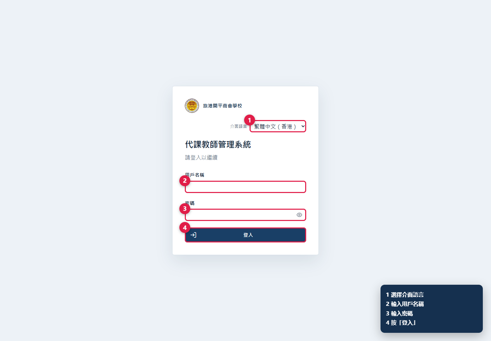
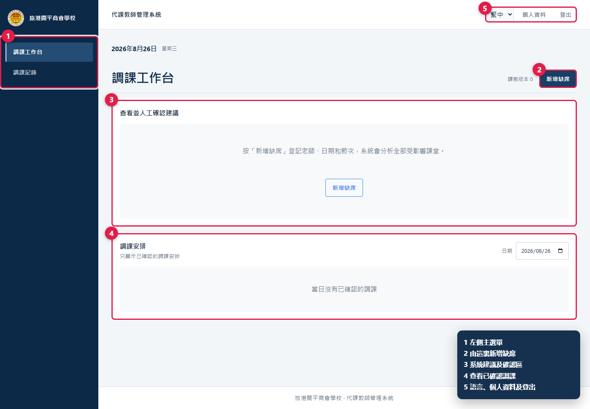
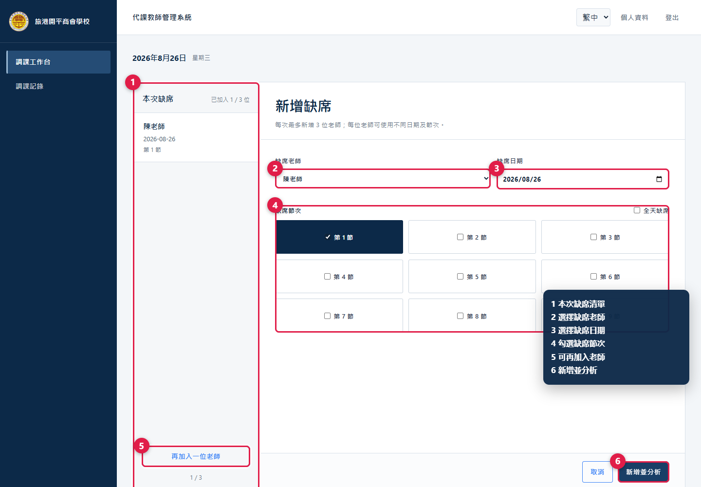
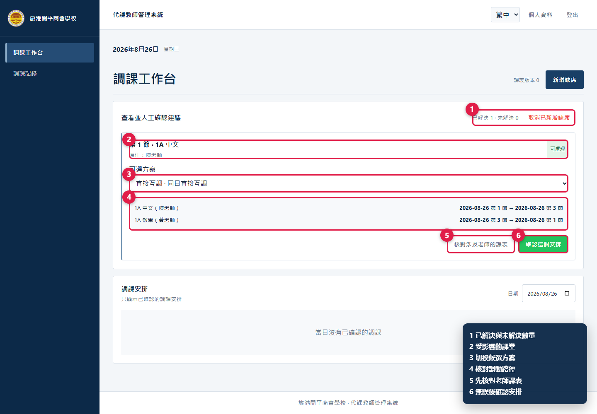
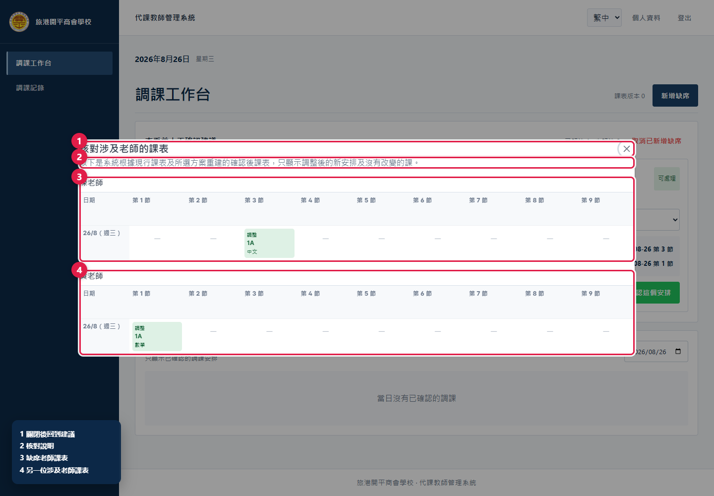
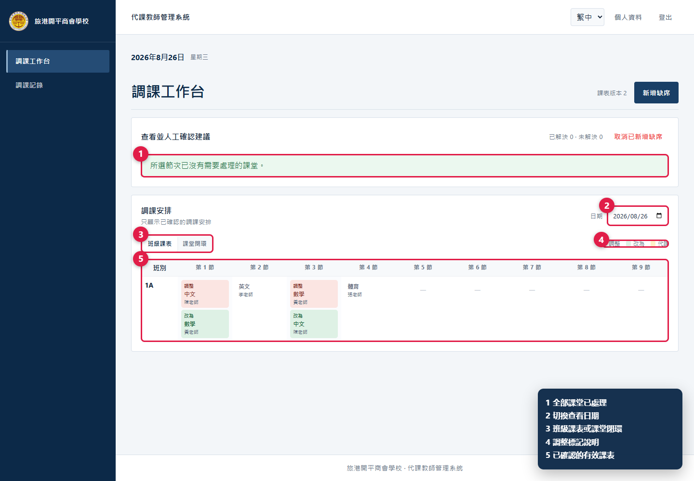
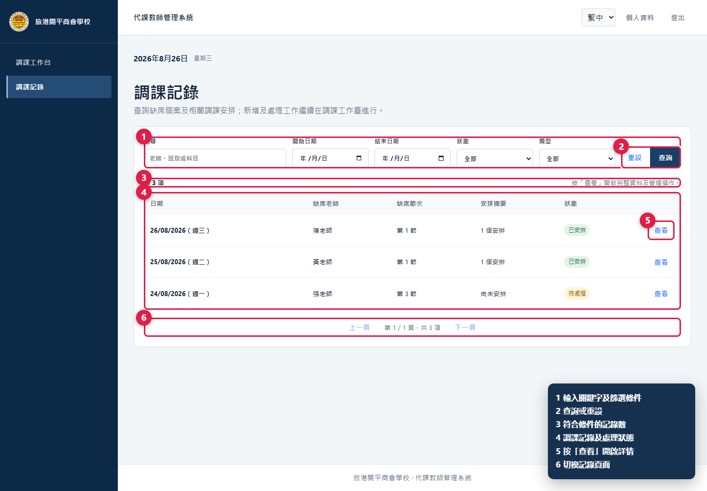
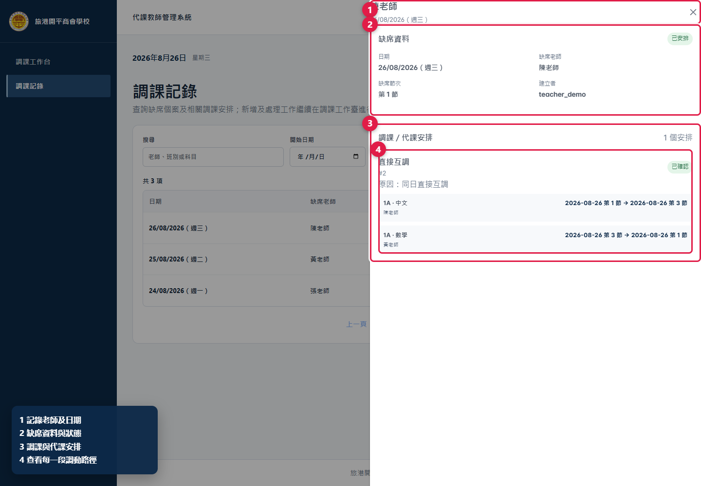
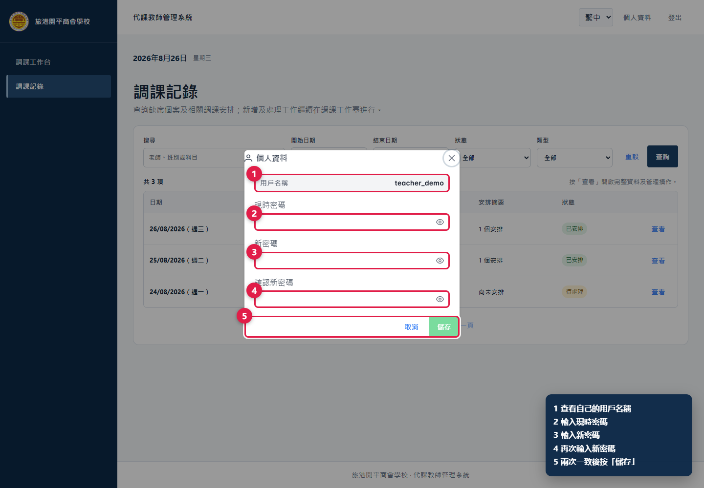

# 代課教師管理系統——用戶使用說明書

適用對象：使用普通用戶帳號的教職員

介面語言：繁體中文（香港）／English

更新日期：2026 年 9 月 1 日

> 圖中的紅框及圓形數字是操作位置，角落圖例說明各標註用途。所有畫面均使用示例資料。

## 一、最快開始

日常處理一宗缺席，可按以下次序：

1. 登入後進入「調課工作台」。
2. 按「新增缺席」，選擇老師、日期、原因及節次。
3. 按「新增並分析」。
4. 選擇系統方案，先按「核對涉及老師的課表」。
5. 確定沒有撞課或不合理調動後，按「確認這個安排」。
6. 在工作台下方或「調課記錄」核對結果。

如看不到某個頁面或按鈕，通常表示帳號未獲該項權限，請聯絡管理員，不要借用其他人的帳號。

## 二、登入、說明及介面

### 2.1 登入

1. 用瀏覽器開啟學校提供的系統網址。
2. 選擇「繁體中文（香港）」或「English」。
3. 輸入用戶名稱和密碼。
4. 按「登入」。

*圖 1　選擇語言、輸入用戶名稱和密碼後登入。*

多次輸入錯誤時，系統會暫停登入並顯示等候時間。請等倒數完成後再試。

### 2.2 主畫面

*圖 2　左側是獲授權的功能；右上方可調整顯示、開啟本說明及管理帳戶。*

- 「調課工作台」：登記缺席、分析及確認建議、查看已確認安排。
- 「調課記錄」：搜尋缺席個案及查看安排詳情。
- 「使用說明」：在新分頁開啟最新版網頁說明書。
- 「顯示設定」：選擇「標準」、「大」或「放大版（緊湊）」字號，以及系統預設、黑體、宋體或楷體。
- 「個人資料」：更改自己的密碼。

顯示設定只保存在目前的瀏覽器，不會改變 Excel 或 PDF。手機版請先按右上角選單按鈕，再選擇功能。

## 三、普通用戶權限

管理員可按工作需要分配以下權限：

| 權限 | 可做的事 |
|---|---|
| 查看調課工作台 | 查看老師、缺席、有效課表及停課日資料 |
| 新增缺席 | 建立及分析缺席；更新自己建立而尚未鎖定的個案 |
| 確認系統建議 | 確認系統產生的調課或代課方案 |
| 人工安排 | 指定代課老師或確認由共同教師繼續上課 |
| 查看調課記錄 | 搜尋及查看記錄詳情 |
| 管理調課記錄 | 修改、撤銷或刪除同校記錄 |
| 查看統計 | 查看所選日期範圍的教師統計 |
| 下載每日表格 | 下載每日 Excel 或單一 PDF |
| 上傳及預覽課表 | 上傳課表及處理差異覆核 |
| 啟用及管理課表 | 啟用、改期或刪除課表版本 |

系統會自動維持所需的上層權限，例如「新增缺席」必須同時能查看工作台；「管理調課記錄」必須同時能查看記錄。

## 四、登記缺席

### 4.1 新增一位或多位老師

1. 在「調課工作台」按「新增缺席」。
2. 選擇缺席老師和日期。
3. 選擇原因：病假、覆診、帶隊訓練或其他。選擇「其他」後可填補充內容，但不要輸入病歷或其他敏感資料。
4. 勾選當日顯示的節次；全日缺席可勾「全天缺席」。普通課表日期顯示第 1 至第 9 節，試後課表日期只顯示第 1 至第 5 節。
5. 如要同批加入其他老師，按「再加入一位老師」。每次最多 3 位，各人可使用不同日期、原因及節次。
6. 核對左側「本次缺席」清單，再按「新增並分析」。

*圖 3　左側管理本次老師清單；右側填寫老師、日期、原因及節次。*

只有日期已有生效課表，而且老師、原因及至少一個節次已選擇時，「新增並分析」才可使用。只勾選老師實際有課而需要處理的節次；空堂不會建立需要安排的課堂。試後日期的 5 節時間依次為 08:25–09:15、09:15–10:05、10:25–11:15、11:15–12:05、12:25–13:00。

### 4.2 同一老師同一天再次缺席

如該老師同一天已有缺席個案，新操作只會追加尚未登記的節次：

- 已存在的節次會標示並停用，不能重複加入；
- 原有原因不會被新操作改寫；
- 不能在「新增缺席」流程移除舊節次；
- 如需改原因、移除節次或刪除個案，必須在「調課記錄」由具管理權限的人員處理。

### 4.3 取消剛新增的缺席

如本批記錄尚未確認任何安排，可按「取消已新增缺席」。一旦已有已確認安排，系統會拒絕整批取消，應由具「管理調課記錄」權限的人員處理。

## 五、閱讀、核對及確認建議

### 5.1 選擇方案

*圖 4　每堂課會顯示可選方案、完整調動路徑，以及核對和確認按鈕。*

每張課堂卡片會顯示節次、班別、科目、原任老師和狀態：

- 「可處理」：已有一個或多個候選，可用下拉選單切換；
- 「未解決」：沒有可直接確認的方案，需由具人工安排權限的人員處理。

系統預先選中的方案只是建議。確認前必須閱讀每一段「原日期／節次 → 新日期／節次」，並留意跨日、連鎖或特殊課程提示。

### 5.2 核對涉及老師的課表

1. 選定候選後按「核對涉及老師的課表」。
2. 對話框最多顯示 3 位老師，依次使用藍、綠、橙色；仍應以老師姓名為準。
3. 變更格同時列出「原」和「現」安排。逐格核對班別、科目、節次及前後課堂。
4. 關閉對話框，返回建議卡片。

*圖 5　不同顏色區分老師；變更格並列原安排與現安排。*

### 5.3 確認

核對無誤後按「確認這個安排」。系統會更新有效課表、寫入調課記錄，並用最新課表重新分析尚未處理的課堂。若系統提示課表已被其他人修改，請重新載入和核對，不要重複提交舊方案。

如所有候選都不合適，可轉到「人工安排」。沒有人工安排權限時，請把日期、節次、班別及科目交給獲授權人員。

## 六、查看已確認安排

*圖 6　按日期查看已確認安排，可切換班級課表或課堂閉環。*

1. 在「調課安排」選擇日期。
2. 選擇「班級課表」查看當日所有節次的變動，或選擇「課堂閉環」查看完整調動路徑；試後日期會自動使用 5 節版面。
3. 核對「調整」、「改為」及「代課」標記，以及老師、班別、科目和節次。

有效課表是系統處理後的最新事實。如一堂已被移動的課後來遇到老師缺席，系統只修復受影響的局部鏈路，不會重做其他無關安排；處理後仍應再次核對當日課表。

## 七、搜尋及閱讀調課記錄

*圖 7　可按搜尋字、日期、狀態和類型篩選記錄。*

1. 進入「調課記錄」。
2. 可輸入老師、班別或科目，並設定開始／結束日期、狀態或類型。
3. 按「查詢」套用；按「重設」清除條件。
4. 在結果右側按「查看」。如個案仍待處理而你有相應權限，可按「繼續處理」返回工作台。

*圖 8　詳情列出缺席原因、安排路徑和執行狀態。*

### 7.1 兩組狀態

| 狀態 | 含義 |
|---|---|
| 待處理 | 仍有受影響課堂未完成安排 |
| 已安排 | 所需安排已確認 |
| 需覆核 | 課表或資料變動後需要重新核對 |
| 尚未開始 | 安排中的課堂尚未到上課時間 |
| 部分完成 | 部分課堂已開始或完成，其他仍在未來 |
| 已完成 | 所有相關課堂時間均已過 |

只有具「管理調課記錄」權限的人員會看到修改、撤銷或刪除操作。同時具「新增缺席」權限時，按鈕會顯示為「重新挑選方案」：撤銷後自動返回工作台，為同一缺席重新分析及選擇。已開始的安排，或已有下游調動依賴的安排，不能直接撤銷；必須先撤銷最新而尚未開始的依賴安排。

## 八、個人資料、更改密碼及登出

*圖 9　輸入現時密碼、新密碼和確認密碼後儲存。*

1. 按右上方「個人資料」。
2. 輸入現時密碼。
3. 輸入新密碼，並在確認欄再次輸入。
4. 按「儲存」。如忘記現時密碼，請聯絡管理員重設。

使用完畢後按「登出」。在公用電腦上不要讓瀏覽器保存密碼，也不要只關閉分頁代替登出。

## 九、獲額外授權後的功能

- 「人工安排」：選擇待處理課堂和合資格代課老師，確認前查看其全日課表。
- 「統計」：按日期範圍查看每位老師參與已確認安排的每月次數。
- 「下載每日表格」：在工作台上方下載 Excel 或 PDF。Excel 是單一活頁簿、多個工作表；PDF 是單一檔案，每頁兩張表，不是 ZIP。
- 「課表匯入」：上傳班別 `.xls` 和教師 `.xlsx`，處理差異並管理版本。這是高影響操作，應依學校安排使用。

## 十、常見問題

### 所選日期未有課表資料

日期不在任何生效課表版本內。先核對日期；如日期正確，請管理員檢查課表版本。

### 沒有可直接確認的方案

現有課表和規則下沒有合適自動方案。交由具人工安排權限的人員處理，不要重複建立相同缺席。

### 不能取消缺席或撤銷安排

個案已有已確認安排、安排已開始，或它被後續調動依賴。請到記錄詳情查看狀態，並由獲授權人員按最新依賴順序處理。

### 找不到某個頁面

功能由權限控制。重新整理後仍沒有顯示，請管理員檢查帳號權限。

### 無法連接伺服器

先檢查網絡並重新整理。問題持續時，向管理員提供發生時間、缺席日期／節次、班別／科目及完整錯誤訊息；不要提供密碼。

## 十一、使用守則

- 只輸入工作所需的缺席原因類別，不要填寫診斷或病歷。
- 確認每個方案前都要核對涉及老師的課表。
- 發現錯誤時先搜尋記錄，不要建立重複個案。
- 示範環境不得輸入真實個人資料。
- 修改、撤銷、刪除、匯出及課表管理只可由獲相應權限的人員執行。
